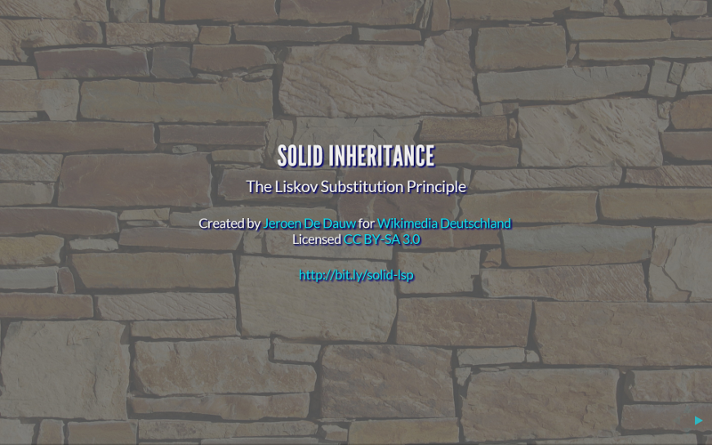
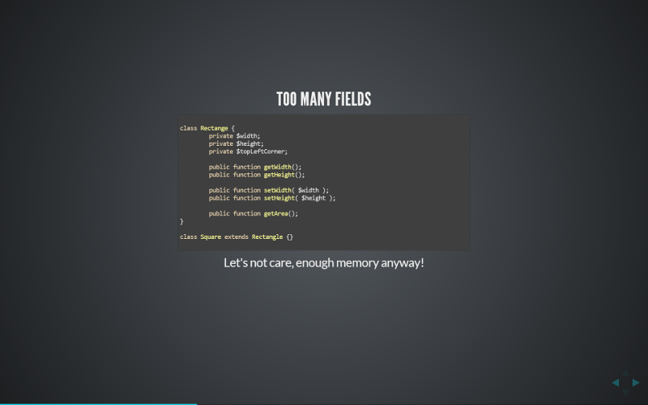

# SOLID INHERITANCE: The Liskov Substitution Principle

Everyone knows how to do inheritance. You create an interface or a base class and implement it or derive from it. Done.

Good software design is however not quite that easy. When using inheritance, a number of basic principles
should be held into account. Favouring of composition over inheritance, not using inheritance for code
reuse and using narrow, well segregated, interfaces come to mind. Even though amongst this list of
fundamentals and critical in nature, the Liskov Substitution Principle is not well known by many developers.

This presentation will introduce to said principle, and teach you how to both recognize violations
and deal with the consequences. Examples of typical violations are provided, the undesired results
are outlined and means to avoid these pitfalls are explained.

## Audience

This presentation is aimed at developers. It is suitable both for people new to the field and those
with many years of experience. Knowledge of inheritance is required.

Examples are mainly in PHP and Java, though the presentation also applies to other OOP languages.
All examples are trivial, so knowledge of these languages is not required, while of course a plus.

## Topic list

The covered topics include:

* Definition of the LSP
* The classical Rectangle and Square example
* Shotgun surgery
* How to avoid being lynched by your fellow developers
* Representations
* Collections meet LSP

## Slides

The presentation contains high quality slides with lots of long complicated sentences, citations and detailed
proofs, to ensure sufficient seriousness.

