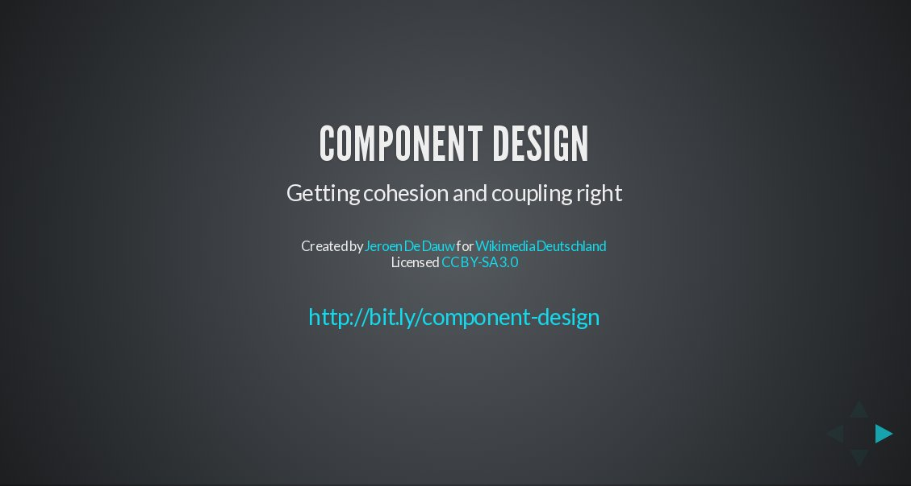
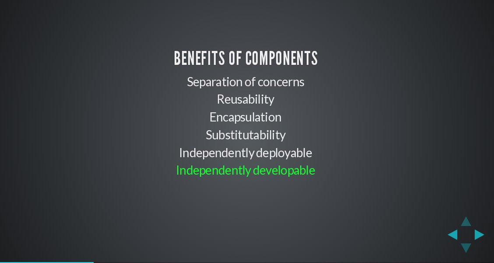
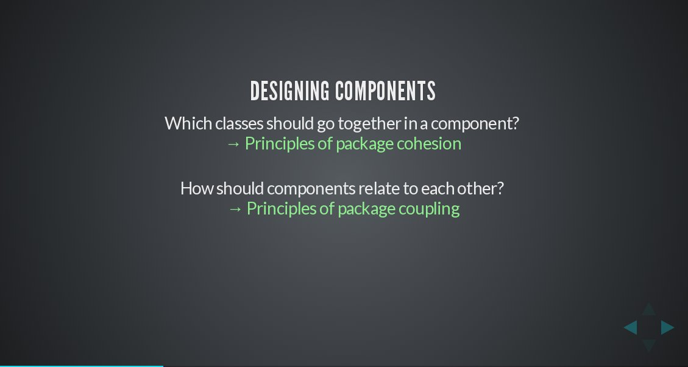
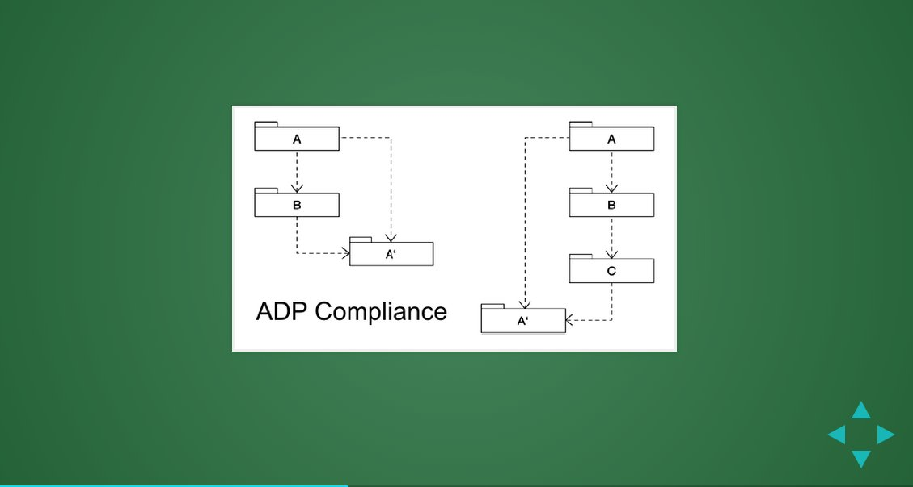
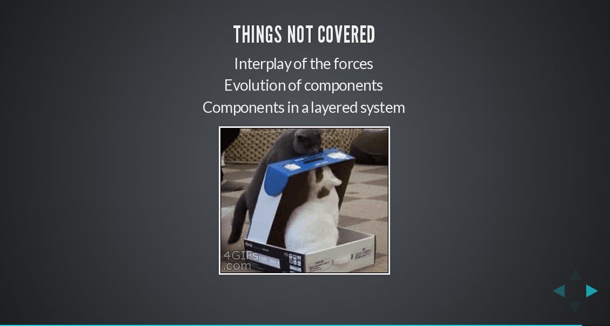

# Component design

Components are a level of organization, in between classes and layers. They are an
important mechanism in avoiding monolithic designs and big balls of mud. While
everyone can recognize a component when they see one, many people are unaware of
the basic principles that guide good component design.

## Audience

This presentation is aimed at developers. It is suitable both for people new to the field
and those with many years of experience.

## Topic list

The topics covered include:

* What is a component?
* Which things go together?
* How do components relate to each other?
* How are common problems avoided?

## Slides preview

